## Nodejs
#### try to get a song from music website by using nodejs crawler

- pick a web `https://www.app-echo.com/#/`

- go to `echo 名人`
- click "查看全部"
- echo 群星
- click "查看全部"

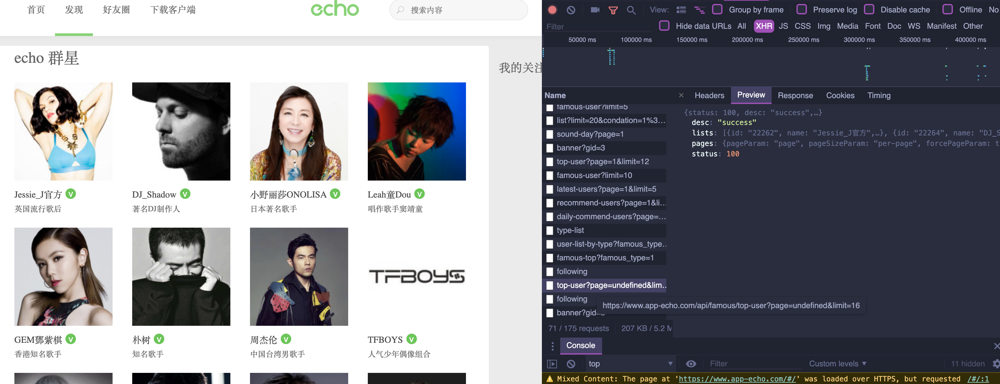
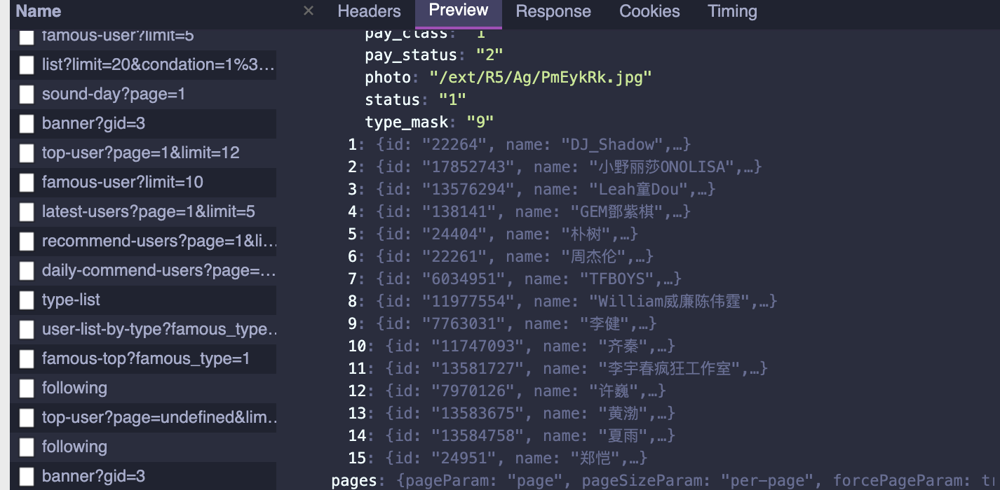
- look at the No.4 "GEM鄧紫棋"
-
- click "GEM鄧紫棋"
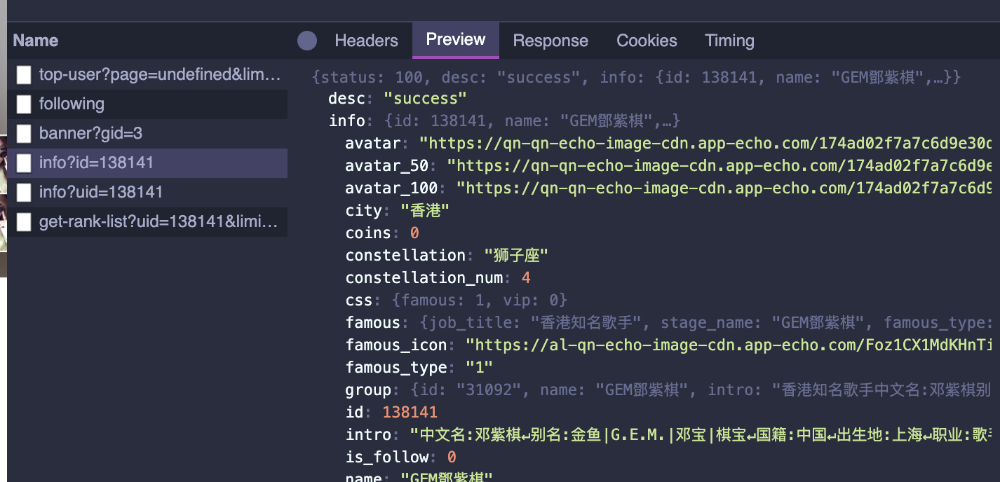

- now go back to "sound-day" page
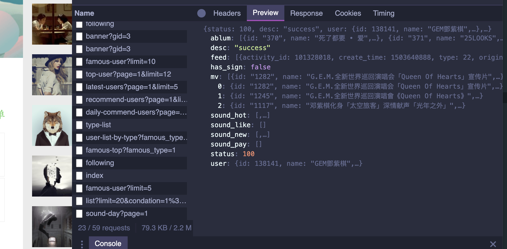
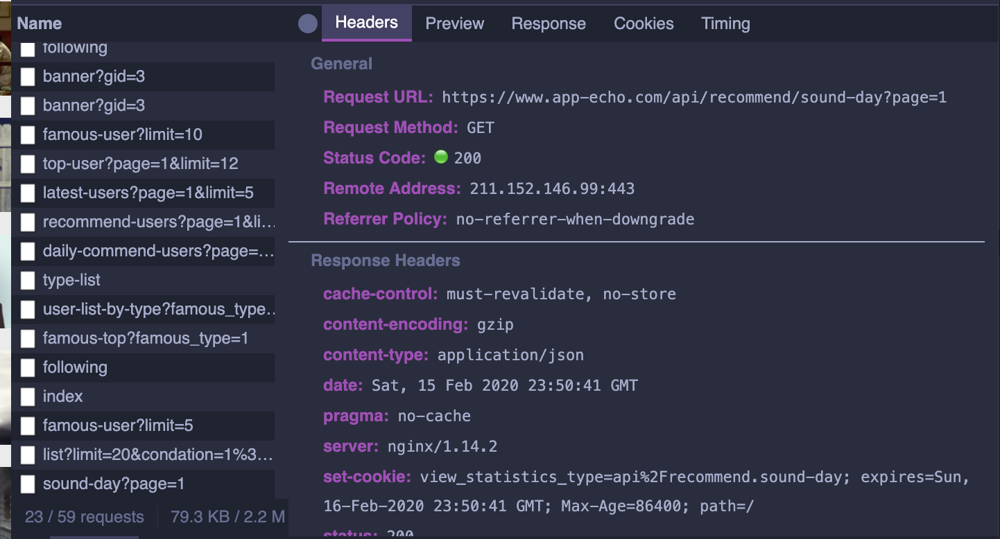

- create a folder 'netMusic'
- index.js
- `npm install --save-dev nodemon`
- `npm install axios `
-
- index.js
```js
const axios = require("axios");

async function getPage(num) {
    let httpUrl = "https://www.app-echo.com/api/recommend/sound-day?page=" + num;
    let res = await axios.get(httpUrl);
    // console.log("hello world");
    console.log(res.data);
}

getPage(1);
```
- print out info
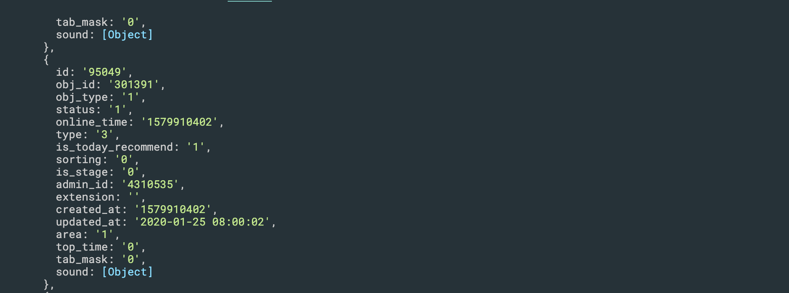
-
- click `Preview`
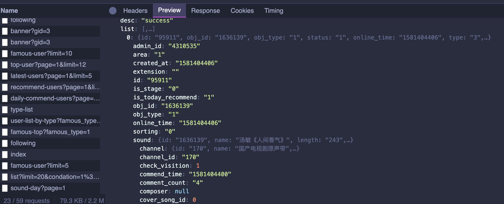
- find out `source`
-
- find out every song'title and source address
- update index.js
```js
const axios = require("axios");

async function getPage(num) {
    let httpUrl = "https://www.app-echo.com/api/recommend/sound-day?page=" + num;
    let res = await axios.get(httpUrl);
    // console.log("hello world");
    console.log(res.data.list);
    res.data.list.forEach(function (item, i) {
        let title = item.sound.name;
        let mp3Url = item.sound.source;
        console.log(title);
        console.log(mp3Url);
    })
}
// async function 
getPage(8);
```
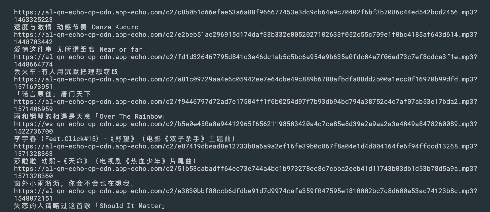
-
-
## create a folder `mp3` to store all .mp3 files
- update index.js
```js
//goal: download music .mp3
//1. get the info of song, get the .mp3 address
const axios = require("axios");
const fs = require("fs");

async function getPage(num) {
    let httpUrl = "https://www.app-echo.com/api/recommend/sound-day?page=" + num;
    let res = await axios.get(httpUrl);
    // console.log(res.data.list);
    res.data.list.forEach(function (item, i) {
        let title = item.sound.name;
        let mp3Url = item.sound.source;
        console.log(title);
        console.log(mp3Url);
        download(mp3Url, title);
    })
}

async function download(mp3Url, title) {
    let res = axios.get(mp3Url, { responseType: "stream" });
    let ws = fs.createWriteStream('./mp3/' + title + ".mp3");
    res.data.pipe(ws);
    res.data.on('close', function () {
        ws.close();
    })
}


getPage(8);
```
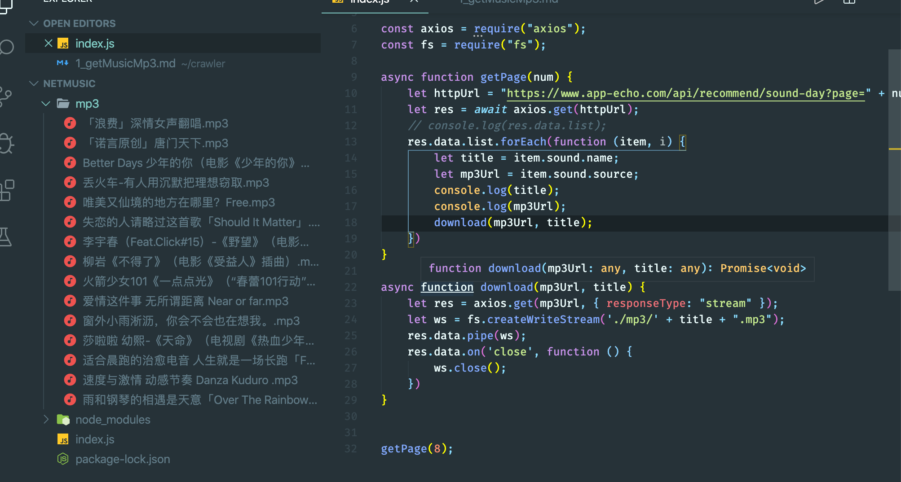
- but I didn't download the songs successfully
-
- update index.js
```js
const axios = require("axios");
const fs = require("fs");
const path = require('path');

async function getPage(num) {
    let httpUrl = "https://www.app-echo.com/api/recommend/sound-day?page=" + num;
    let res = await axios.get(httpUrl);
    // console.log(res.data.list);
    res.data.list.forEach(function (item, i) {
        let mp3Url = item.sound.source;

        console.log(path.parse(mp3Url));
        console.log(mp3Url);
    })
}

async function download(mp3Url, title) {
    let res = axios.get(mp3Url, { responseType: "stream" });
    let ws = fs.createWriteStream('./mp3/' + title + ".mp3");
}

getPage(8);
```
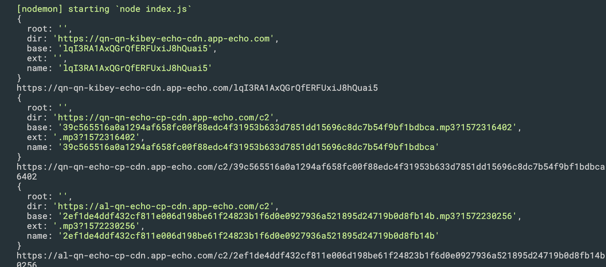
---


-
- update index.js
```js
const axios = require("axios");
const fs = require("fs");
const path = require('path');

async function getPage(num) {
    let httpUrl = "https://www.app-echo.com/api/recommend/sound-day?page=" + num;
    let res = await axios.get(httpUrl);
    // console.log(res.data.list);
    res.data.list.forEach(function (item, i) {
        let title = item.sound.name;
        let mp3Url = item.sound.source;
        let fileName = path.parse(mp3Url).name;

        let content = `${title},${mp3Url},${fileName}\n`
        fs.writeFile('music.txt', content, { flag: 'a' }, function () {
            console.log("Written: " + title);
        });
        console.log(fileName);
        console.log(mp3Url);
        download(mp3Url, fileName);
    })
}

async function download(mp3Url, fileName) {
    axios.get(mp3Url, { responseType: "stream" }).then(function (res) {
        let ws = fs.createWriteStream('./mp3/' + fileName + ".mp3");
        res.data.pipe(ws);
    });
    // res.data.on('close', function () {
    //     ws.close();
    // })
}

getPage(8);
```
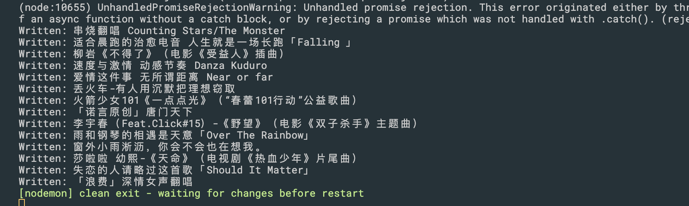
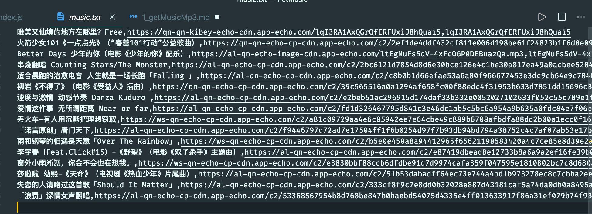

---
- final result
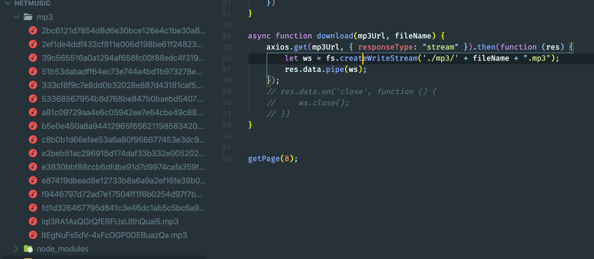
